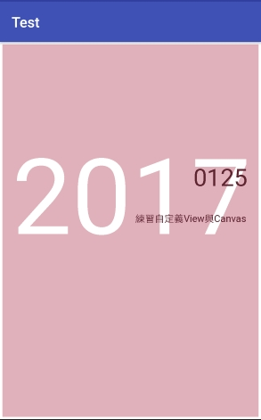

# custom-views
practice custom views & canvas

練習自定義views和canvas 

繼承text view(中間桃色部分)，並擴充外框(最外面細細的白框)。
組合為一個自定義view。
(有外框的textView)

中間文字部分皆為canvas。

App download >
https://drive.google.com/open?id=0B0csiWXavBDHblBmcDAyNFdqVFU
